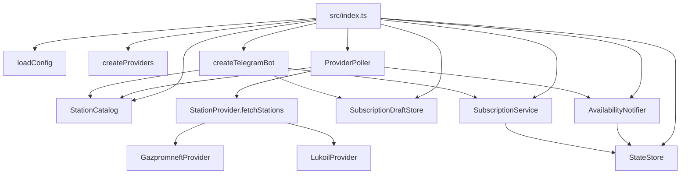

# Архитектура

Этот документ описывает фактическую архитектуру `FuelFinderBot` по состоянию исходников в рабочем каталоге.

## Общая схема

## Жизненный цикл приложения

Подтверждено по [src/index.ts](/Users/b.kostyuchenko/Documents/Developer/FuelFinderBot/src/index.ts:1):

1. Загружается конфигурация через `loadConfig()`.
2. Создаётся `Logger`.
3. Инициализируется `StateStore` и вызывается `load()`.
4. Создаются `StationCatalog`, `SubscriptionService`, `SubscriptionDraftStore`.
5. По `enabledBrands` создаются провайдеры через `createProviders()`.
6. Создаются `ProviderPoller`, Telegram-бот и `AvailabilityNotifier`.
7. Выполняется первый `runPoll()` до запуска polling по таймеру.
8. Настраивается `setInterval(..., pollIntervalMs)`.
9. Запускается Telegram-бот через `bot.start()`.

## Слои

### Domain

Файлы:

- [src/domain/types.ts](/Users/b.kostyuchenko/Documents/Developer/FuelFinderBot/src/domain/types.ts:1)
- [src/domain/brands.ts](/Users/b.kostyuchenko/Documents/Developer/FuelFinderBot/src/domain/brands.ts:1)
- [src/domain/fuels.ts](/Users/b.kostyuchenko/Documents/Developer/FuelFinderBot/src/domain/fuels.ts:1)

Роль:

- базовые типы `Brand`, `Station`, `StationSubscription`, `PersistedState`;
- человекочитаемые подписи брендов;
- формат ключа станции `brand:stationId`;
- сортировка видов топлива по русской локали.

### Providers

Файлы:

- [src/providers/types.ts](/Users/b.kostyuchenko/Documents/Developer/FuelFinderBot/src/providers/types.ts:1)
- [src/providers/index.ts](/Users/b.kostyuchenko/Documents/Developer/FuelFinderBot/src/providers/index.ts:1)
- [src/providers/gazpromneft.ts](/Users/b.kostyuchenko/Documents/Developer/FuelFinderBot/src/providers/gazpromneft.ts:1)
- [src/providers/lukoil.ts](/Users/b.kostyuchenko/Documents/Developer/FuelFinderBot/src/providers/lukoil.ts:1)

Роль:

- адаптация внешнего API бренда к контракту `StationProvider`;
- нормализация данных станций к доменной модели `Station`;
- отбор только станций Москвы и Московской области.

### Services

Файлы:

- [src/services/catalog.ts](/Users/b.kostyuchenko/Documents/Developer/FuelFinderBot/src/services/catalog.ts:1)
- [src/services/state-store.ts](/Users/b.kostyuchenko/Documents/Developer/FuelFinderBot/src/services/state-store.ts:1)
- [src/services/subscription-service.ts](/Users/b.kostyuchenko/Documents/Developer/FuelFinderBot/src/services/subscription-service.ts:1)
- [src/services/subscription-drafts.ts](/Users/b.kostyuchenko/Documents/Developer/FuelFinderBot/src/services/subscription-drafts.ts:1)
- [src/services/poller.ts](/Users/b.kostyuchenko/Documents/Developer/FuelFinderBot/src/services/poller.ts:1)
- [src/services/availability-notifier.ts](/Users/b.kostyuchenko/Documents/Developer/FuelFinderBot/src/services/availability-notifier.ts:1)

Роль:

- управление текущим каталогом станций;
- хранение подписок и снимков доступности;
- опрос провайдеров;
- обнаружение перехода `нет -> есть`;
- временное хранение черновиков выбора топлива.

### Telegram interface

Файл:

- [src/bot.ts](/Users/b.kostyuchenko/Documents/Developer/FuelFinderBot/src/bot.ts:1)

Роль:

- обработка команд `/start`, `/help`, `/find`, `/subscriptions`, `/stop`;
- inline-flow создания и редактирования подписок;
- валидация callback payload;
- логирование ошибок `bot.catch(...)`.

## Архитектурные наблюдения

Подтверждённые:

- приложение однопроцессное;
- `StationCatalog` и `SubscriptionDraftStore` живут только в памяти;
- долговременное состояние централизовано в одном JSON-файле;
- polling и Telegram-бот работают в одном runtime-процессе;
- сбой одного провайдера не останавливает общий цикл `pollOnce()`.

Предположения, которые не следует считать фактом:

- пригодность архитектуры для горизонтального масштабирования;
- безопасность параллельного запуска нескольких экземпляров на одном `state.json`;
- достаточность polling-модели при росте числа брендов и пользователей.
