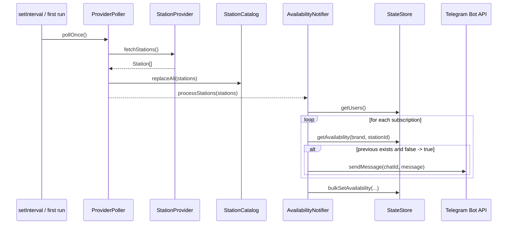
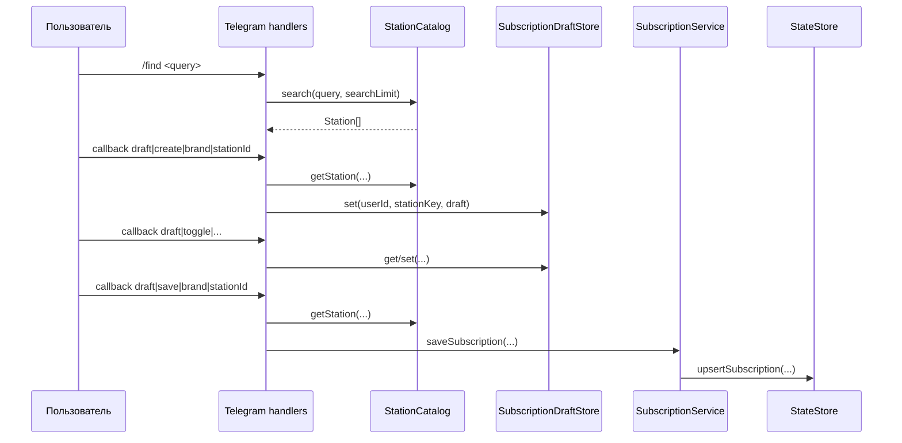

# Компоненты и потоки данных

## Основные компоненты

### `loadConfig`

Источник: [src/config.ts](/Users/b.kostyuchenko/Documents/Developer/FuelFinderBot/src/config.ts:1)

Подтверждено:

- читает `.env` через `dotenv`;
- требует `BOT_TOKEN`;
- создаёт `DATA_DIR`, если каталог отсутствует;
- вычисляет путь `stateFilePath = resolve(dataDir, "state.json")`;
- отбрасывает неподдерживаемые бренды из `ENABLED_PROVIDERS`;
- выбрасывает ошибку, если после фильтрации не осталось ни одного реализованного провайдера.

### `StateStore`

Источник: [src/services/state-store.ts](/Users/b.kostyuchenko/Documents/Developer/FuelFinderBot/src/services/state-store.ts:1)

Подтверждено:

- хранит `users` и `availability`;
- при первом запуске создаёт файл состояния;
- сериализует состояние в JSON с отступом `2`;
- после каждого изменения подписок или снимков вызывает `persist()`.

### `SubscriptionService`

Источник: [src/services/subscription-service.ts](/Users/b.kostyuchenko/Documents/Developer/FuelFinderBot/src/services/subscription-service.ts:1)

Подтверждено:

- сохраняет одну подписку на пару `(brand, stationId)`;
- дедуплицирует `fuelCodes` через `Set`;
- формирует `stationLabel` как `Бренд • Название • Город`.

### `SubscriptionDraftStore`

Источник: [src/services/subscription-drafts.ts](/Users/b.kostyuchenko/Documents/Developer/FuelFinderBot/src/services/subscription-drafts.ts:1)

Подтверждено:

- использует `Map<string, DraftState>`;
- ключ строится как `${userId}:${stationKey}`;
- не имеет постоянного хранилища.

### `StationCatalog`

Источник: [src/services/catalog.ts](/Users/b.kostyuchenko/Documents/Developer/FuelFinderBot/src/services/catalog.ts:1)

Подтверждено:

- хранит станции по ключу `brand:stationId`;
- полностью заменяет каталог через `replaceAll(stations)`;
- поиск учитывает `displayName`, `city`, `address`, `stationId`;
- поиск работает через простую scoring-модель, а не через полнотекстовый индекс.

### `ProviderPoller`

Источник: [src/services/poller.ts](/Users/b.kostyuchenko/Documents/Developer/FuelFinderBot/src/services/poller.ts:1)

Подтверждено:

- опрашивает провайдеры последовательно;
- логирует успех и ошибку по каждому провайдеру;
- по завершении обновляет `StationCatalog`.

### `AvailabilityNotifier`

Источник: [src/services/availability-notifier.ts](/Users/b.kostyuchenko/Documents/Developer/FuelFinderBot/src/services/availability-notifier.ts:1)

Подтверждено:

- смотрит только на станции, которые пришли в текущем `pollOnce()`;
- уведомляет только при переходе `false -> true`;
- после обработки всех пользователей сохраняет новые снимки доступности через `bulkSetAvailability(...)`.

## Поток данных: от внешнего API до уведомления

## Поток данных: создание подписки

## Формат callback payload

Подтверждено по [src/bot.ts](/Users/b.kostyuchenko/Documents/Developer/FuelFinderBot/src/bot.ts:1):

- `draft|create|{brand}|{stationId}`
- `draft|edit|{brand}|{stationId}`
- `draft|toggle|{brand}|{stationId}|{fuelCode}`
- `draft|save|{brand}|{stationId}`
- `draft|cancel|{brand}|{stationId}`
- `sub|remove|{brand}|{stationId}`

## Что важно для эксплуатации

Подтверждено:

- удаление станции из текущего каталога делает невозможным редактирование подписки через актуальную карточку станции;
- отсутствие previous snapshot блокирует отправку первого уведомления;
- подписки постоянные, черновики временные.
- корректность availability для `lukoil` зависит от публичных cartography-эндпоинтов Лукойла и их текущей семантики.
